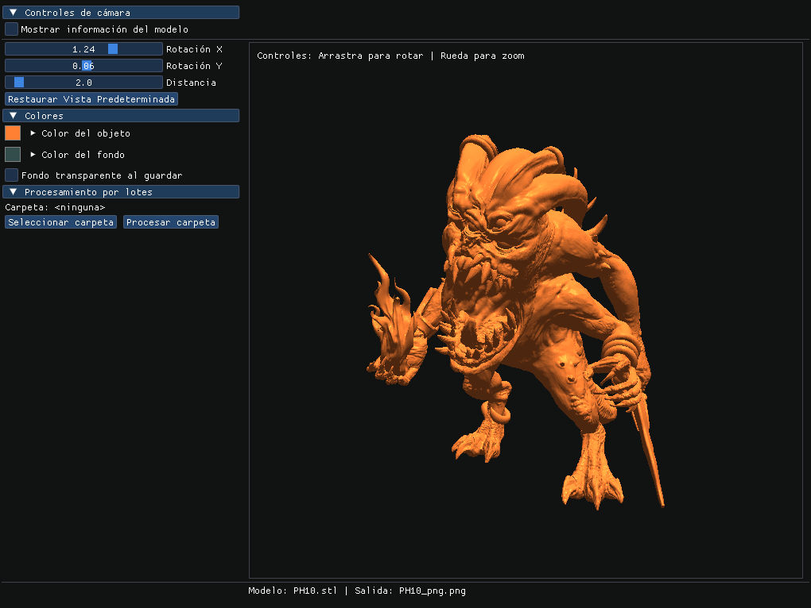

# Why STL Renderer?

One thing I've been using A LOT is stltopng from `Papa's Best` but the project didn't see any update past 2021 and to be honest... it was SUPER NECESARY to make an update haaha, so I've made a new app:

`GUI to set the camera angle and zoom`
`Directory rendering (Render all STL files from a specific directory)`
`Single and Multi Drag-n-drop behaviour in the same exe`

The idea is that you can drag-n-drop a single stl or multiple stl and it'll create the corresponding PNG renders at ULTRA FRECKING MEGA FAST SPEED with all your settings.... with `transparent background too :D`

# STL Renderer

STL Renderer is a high-performance application for converting STL files to PNG images. It is designed to be extremely fast and allow both individual and batch processing.



## Features

- 🚀 Ultra-fast rendering of STL files to PNG
- 🎨 Support for transparent backgrounds
- 🖌️ Customizable color settings for model and background
- 📷 Precise camera control (rotation, distance, zoom)
- 📁 Batch processing of entire folders
- 🖱️ Drag and drop functionality (single or multiple files)
- 💻 Intuitive graphical interface
- 🔧 Configuration saved between sessions

## Usage

### Drag and Drop

Simply drag one or more STL files onto the `STLRenderer.exe` executable. This will automatically generate PNG images with the same name (adding `_png.png`) in the same folder as the original files.

### Graphical Interface

To open the graphical interface, double-click on the `STLRenderer.exe` executable. From here you can:

1. Open STL files from the **File > Open** menu
2. Adjust model and background colors in the **Colors** panel
3. Configure camera rotation and distance with the **Camera** controls
4. Interactively rotate the model with the mouse in the preview window
5. Process entire folders with STL files from **File > Process folder**
6. Save the current image from **File > Save image**

## Command Line

STL Renderer can also be used from the command line to automate tasks:

```bash
stlrenderer [options] [stl_files]
```

Available options:
- `-h, --help` - Show help
- `-v, --version` - Show version
- `-s, --silent` - Silent mode (no GUI)
- `-c, --color R G B` - Set model color (values between 0.0 and 1.0)
- `-bg, --background R G B` - Set background color (values between 0.0 and 1.0)
- `-a, --angle A` - Set camera angle in degrees
- `-o, --output FILE` - Set output file for rendered image

## System Requirements

- Windows 7 or higher
- Graphics card compatible with OpenGL 3.3+

## Building from Source

### Requirements

- CMake 3.10 or higher
- C++17 compatible compiler (MSVC, GCC, Clang)
- OpenGL 3.3 or higher

### Steps

1. Clone the repository:
   ```bash
   git clone https://github.com/SynrgStudio/stl-renderer.git
   cd stl-renderer
   ```

2. Create build directory:
   ```bash
   mkdir build
   cd build
   ```

3. Configure with CMake:
   ```bash
   cmake ..
   ```

4. Build:
   ```bash
   cmake --build . --config Release
   ```

5. The executable will be available in the `build/Release/` folder

## Contributing

Contributions are welcome. Please check [CONTRIBUTING.md](CONTRIBUTING.md) for more details on the contribution process.

## Documentation

To better understand the code structure and how it works internally, see [DOCUMENTATION.md](DOCUMENTATION.md).

## Roadmap

Some features we plan to add in the future:

- Support for other 3D formats (OBJ, FBX, etc.)
- Additional lighting modes
- Customizable shaders
- Export to additional formats (JPG, SVG, etc.)
- Support for Linux and macOS

## License

This project is licensed under the [GNU GPL v3 License](LICENSE) - see the LICENSE file for details. This ensures that any derivative work also remains as free and open-source software.

## Contact

If you have any questions or suggestions, feel free to open an issue in this repository.

---

Developed with ❤️ by Damian from SynrgStudio and Claude ❤️ (Yeah, I'm not a good dev, and Claude helped me a lot on this one, get over it XD)